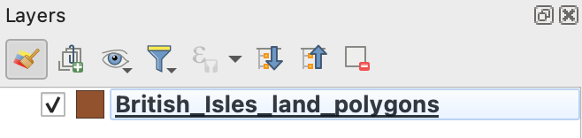
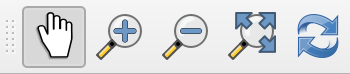
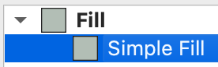
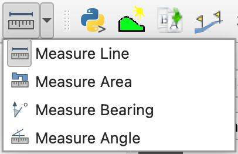
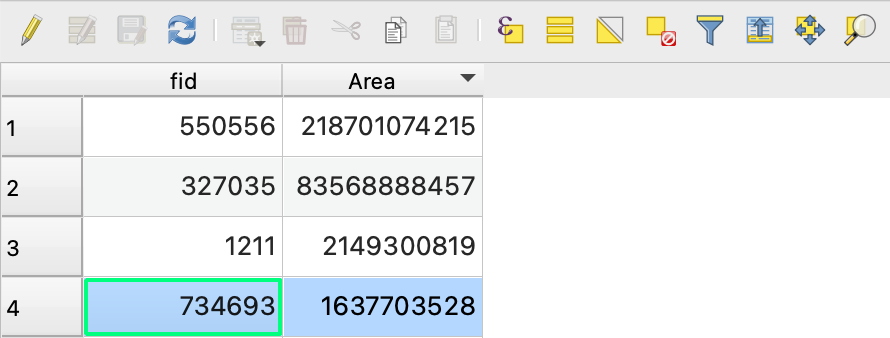
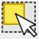
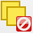
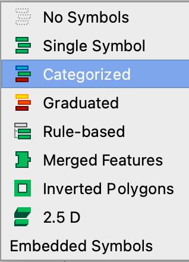
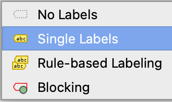
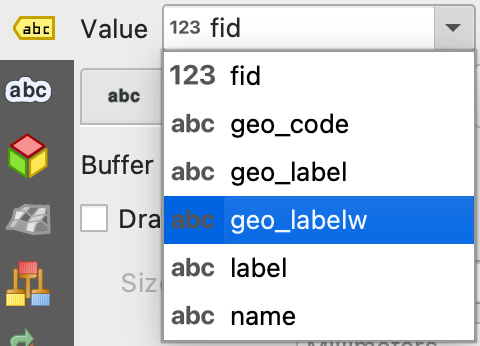

# Dechrau arni {#sec-e01}

> **Date of practical:** 2nd October 2025

To master QGIS, one must start with the basics. This exercise introduces the foundational skills that will underpin the rest of this module and beyond - including your dissertation. Take your time, ask questions, and make sure you are confident with each step before moving on.

::: {.callout-note}
# Learning aims

To become familiar with the Quantum GIS (QGIS) environment for visualising and processing geospatial data. You will learn how to open various types of data layer, adjust the way they look, explore their attributes, and select features for further analysis. 
:::

## <input type="checkbox"> Starting up

(@) **Check this works: Go to OneDrive on the web (onedrive.live.com or your work/school portal). Navigate to Shared in the left sidebar, then find the folder shared with you
Open the folder and click Sync in the top toolbar. This will download and sync the folder to your PC, and it'll appear in File Explorer under your OneDrive section**

(@) Launch `QGIS`. This could be on a University computer, via a remote desktop, or on your own computer

(@) From the menu bar, click `Project` > `New`. Find the shortcut icon to create a new project

(@) Add your first vector layer in QGIS. From the menu bar, click `Layer` > `Add Layer` > `Add Vector Layer...`

(@) Click the `Browse` icon ({width=3%}) and navigate to the folder where the data is stored, i.e. **`GEG276`**

(@) Open the `British_Isles_land_polygons` folder and click on the corresponding `.gpkg` vector layer

(@) Click `Open` > `Add` > `Close`. This dataset from the OpenStreetMap project consists of polygons representing the many islands making up the British Isles. Note the layer is now listed under the `Layers` panel. You can also drag-and-drop datasets from the browser straight into the Map Canvas

{fig-align='center' width=50%}

## <input type="checkbox"> Navigation

(@) Use the `Map Navigation Toolbar` to explore this dataset by panning and zooming

{fig-align='center' width=50%}

(@) Try using the mouse scroll wheel as a shortcut

(@) Make yourself familiar with navigating around the Map Canvas by losing yourself! Pan and zoom until you can't see the British Isles layer anymore

(@) Once lost, right-click on the layer in the `Layers` panel and click `Zoom to Layer(s)` to easily return to view that layer

## <input type="checkbox"> Adjusting style properties {#sec-properties}

(@) From the `Layers` panel, right-click on `British_Isles_land_polygons` and click `Properties...` > `Symbology`. A useful shortcut to `Properties` is to double-click the layer

(@) Click `Simple Fill` and experiment with changing the layer symbology's colours, styles, and widths. You have complete control over how vector layers appear. When designing a map, consider carefully how to choose an appropriate style for each layer

{fig-align='center' width=25%}

(@) From the menu bar, click `Project` > `Save` and save your project to a suitable location. Find the shortcut. Remember to save regularly from now on!

## <input type="checkbox"> Measuring geospatial objects

(@) Click the drop-down arrow next to the `Measure` icon to select the appropriate tool for measuring:
  
    i. The length of Great Britain (in miles)
    ii. The approximate area of the Isle of Man (in square kilometres)

{fig-align='center' width=30%}

(@) Use left-click to add points, and right-click to stop taking the length / area measurements

(@) Share your answers on Menti! Being able to measure geographic features is a fundamental objective of GIS analysis

## <input type="checkbox"> Exploring the Attribute Table

(@) From the `Layers` panel, right-click on `British_Isles_land_polygons` and click `Open Attribute Table`

::: {.callout-tip}
# The Attribute Table

An attribute table is a fundamental part of all GIS datasets. Each row of the table corresponds to a single feature (e.g. a polygon) of the vector layer, and each column, or attribute (of which there can be as many as is needed), records a property of the feature (e.g. name, area, circumference). This particular data layer has two attributes: `fid` (field identifier) and `Area`.
:::

(@) Arrange the Map Canvas and attribute table windows so that you can see both on screen at once. To understand how the attribute table corresponds with the vector layer:

    i. Sort the attribute table according to each polygon's area by clicking the `Area` column title. Repeated clicks will sort by ascending or descending the values
    ii. Click a row number to select the polygon to which it corresponds. The selected polygon in the Map Canvas has now been highlighted yellow
    iii. Click the `Zoom map to the selected rows` icon in the top-right corner ({width=3%}) to zoom to the selected polygon in the Map Canvas

{fig-align='center' width=50%}

(@) Repeat the step above to explore the ten largest islands of the British Isles. Can you name the seventh-largest? If so, submit it on Menti!

(@) You can also select features in the Map Canvas to identify their corresponding attributes in the attributes table:

    i. Click the `Select Features` icon ({width=3%})
    ii. Select (highlight in yellow) the Isle of Wight
    iii. In the attribute table, click the `Move selection to top` icon ({width=3%}) to move the selected line of the table to the top
    iv. Read the area of the feature - which is in square metres - and convert it to square km (i.e. divide by 1,000,000) 
    v. Report your result on Menti!

(@) Click the `Deselect features` icon ({width=3%}) to deselect the current selection. These functions will be very useful later on

## <input type="checkbox"> Arranging layers 

(@) Add the `Wales_Principal_Areas.gpkg` layer in the `UK_Boundaries` folder to your project. This dataset consists of polygons representing the Principal Areas (otherwise known as counties) of Wales. Note this layer will also appear in the `Layers` panel

(@) Adjust the style of this layer and explore its attribute table

(@) Experiment with switching layer visibility on or off using the tick boxes in the `Layer` panel ({width=3%}). This becomes essential when managing multiple layers in a project

(@) Change the order of the layers by dragging each upwards or downwards in the layer panel

::: {.callout-tip}
# Boundary disputes

Notice how the seaward political (Principal Area) boundary of Wales goes beyond the coastline (Land Polygons). This is because the physical land boundary is generally classified according to the mean high water mark, while administrative boundaries are normally classified according to the mean low water mark. That's Geography!
:::

(@) Move `Wales_Principle_Areas` to the top of the `Layers` panel

(@) Open the layer's `Symbology` window

(@) Use the drop-down menu to change the symbology source from `Single Symbol` to `Categorized`

{fig-align='center' width=25%}

(@) Use the `Value` drop-down menu to select the attribute `name`

(@) Click `Classify` > `OK`. How colourful!

## <input type="checkbox"> Labelling layers

(@) Select `Wales_Principal_Areas layer` in the `Layers` panel

(@) From the menu bar, click `Layer` > `Labelling`. Find the shortcuts to this window (hint - check out `Properties...`) 

(@) Use the drop-down menu to change the labelling source from `No Labels` to `Single Labels`

{fig-align='center' width=30%}

(@) Change the `Value` drop-down menu to label the Wales Principle Area polygons according to their English or Welsh names 

{fig-align='center' width=30%}

(@) Experiment with modifying the labels by:

    i. Changing the text style ({width=3%}) e.g. style and size
    ii. Changing the label format ({width=3%}) e.g. wrapping and orientation
    iii. Adding a text buffer ({width=3%})
    iv. Changing the label placement ({width=3%})
    v. Playing around with other options. You are in complete control!
    vi. Have you saved your project recently?

::: {.callout-tip}
# Smart labelling

Now that the Principal Areas have been labelled, zoom out. Notice how QGIS chooses to place and resize the labels so that they remain visible, but switches some of them off to avoid overlapping text. This is a fundamental part of map design and QGIS tries to optimize readability. You can control this behavior through the `Labelling` window and you are encouraged to experiment.
:::

## <input type="checkbox"> Adding and filtering data

(@) Add the vector layer `Wales_operational_windfarms.gpkg` to your project. These data are from the UK Renewable Energy Planning Database and represent the location of operational wind farms across Wales

(@) Examine the attribute table

(@) Adjust the layer's style, noting that point data is represented in a different way to polygon data

(@) Label the wind farms by their name or by their generation capacity

(@) Add the vector layer `gis_osm_roads_free_1.gpkg`, which is in the folder `British_Isles_geofabrik` > `wales`. These data form part of the Open Street Map project and represent all roads in Wales. This is a large dataset and may take time to load and display

(@) Once again, for this layer:

    i. Examine the attribute table
    ii. Experiment with different styles for line data
    iii. Try labelling the roads with the attribute `ref` (i.e. the road number). See how these labels are displayed as you zoom in and out of the map

(@) There is a lot of data here! So let's subset it. There are many ways to make subsets of data layers to select only the data you need or that you want to display. To filter the data universally: 

    i. Right-click on the roads layer and click `Filter...`
    ii. This tool allows you to easily see all the unique values contained in each field (or column) of the attribute table. Click `fclass` > `All`. You can now see all the unique classes of road in the vector layer
    iii. Under `Provider Specific Filter Expression`, type `"fclass" IN ('primary', 'trunk', 'motorway')`. Make sure of precise punctuation and spacing
    iv. Click `OK`. Your map should now only display roads classed as primary and secondary. A funnel icon ({width=3%}) has also appeared next to the layer in name in the `Layers' panel, to remind you a filter has been applied
    v. Experiment with the filter to see which combinations of data you can display
    vi. When you have finished, click `Clear` > `OK` to remove the filter and close the tool

(@) To filter the data by defining what is presented in the map:

    i. Open the layer's `Symbology` window
    ii. Use the `Categorized` option to categorise the road symbology according to the `fclass` attribute
    iii. Delete all the road classes except `primary`, `trunk`, and `motorway`. See if you can make this task easier for yourself by using the `Shift` and `Ctrl` keys...
    iv. Double-click the line symbol per category to choose a suitable symbology for these remaining roads (e.g. thick red for primary, very thick light blue for motorway)

(@) Add the `gis_osm_waterways_free_1.gpkg` vector layer in the  `British_Isles_geofabrik` > `wales` folders. What colour would be best for these?

## <input type="checkbox"> Adding external data

(@) Navigate to [datamap.gov.wales](https://datamap.gov.wales/){target='_blank'}

(@) Search for "Wales Coast Path" and click on the link

(@) Under `Select spatial data format`, choose `OFC Geopackage` and click `Download`

(@) Move the downloaded file to your OneDrive

(@) Open the layer in QGIS and explore it

(@) Try searching for and downloading other GIS data files from DataMapWales, geofabrik.de, or any another source

(@) When you've found a juicy dataset, report it on Menti

::: {.callout-tip}
# Dissertation ideas

Searching for geospatial datasets should show you how easy it can be to find and download data from the internet. This will also provide inspiration for dissertation ideas, which is now on your horizon
:::

## <input type="checkbox"> Have you finished? 

(@) Congratulations! You've learned the basics of QGIS. Make sure that you've understood all the steps above. Repeat if necessary, and ask for help or advice from the demonstrators. You will need this knowledge in future exercises and for the assessments.

::: {.callout-note}
# Learning outcomes

By the end of this exercise you should: 

1. Be able to create a new QGIS project, add vector layers, change their style and navigate around them. 
2. Understand how to re-order layers, switch layer visibility on and off, and remove layers. 
3. Appreciate the relationship between GIS layers and attribute tables, and be able to label features. 
4. Know how to download data for use in QGIS.
:::
