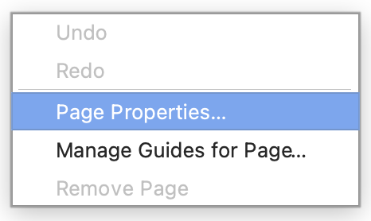
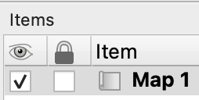
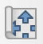
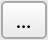

# Dylunio mapiau {#sec-e02}

> **Date of practical:** 9th October 2025

Communication of geographical data and concepts through maps is a fundamental skill for spatial scientists. Creating maps requires both the ability to make them complete, correct and functional, and the flair to make them interesting and attractive. This exercise introduces the QGIS Print Layout window, and the final product represents your "Map 1". assignment.

::: {.callout-note}
## Learning aims

To create functionally complete maps in QGIS for print or digital output. You will learn how to create a 1:1,000,000 scale map of Wales illustrating mean wind speed and county boundaries.
:::

## <input type="checkbox"> Creating a print layout

(@) Launch QGIS and create a new project

(@) Import the `British_Isles_land_polygons.gpkg`, `Wales_border.gpkg`, and `Wales_Principal_Areas.gpkg` layers (the latter two are in the `UK_Boundaries` folder)

(@) Label the Principal Areas of Wales in Welsh or English

(@) Click `Project` > `New Print Layout...` (and find the shortcuts to this window)

(@) Give the print layout an appropriate title

::: {.callout-tip}
# Multiple layouts

You can create more than one print layout. Use `Project` > `Layout Manager...` to easily access and organise layouts associated with your particular QGIS project.
:::

(@) Arrange the Map Canvas and Print Layout windows so you can see both at once. Subsequent instructions refer to the Print Layout window unless otherwise stated

(@) Change the page orientation to A4 portrait:

    i. Right‑click on the blank print layout
    ii. Click `Page Properties...`
    
    {fig-align='center' width=25%}
    
    iii. Change `Size` to `A4`
    iv. Change `Orientation` to `Portrait`

## <input type="checkbox"> Adding and adjusting a map item {#sec-mapitem}

(@) Click `Add Item` > `Add Map` (look for the shortcut) 

(@) Draw a map onto the print layout. `Map 1` should now appear under the `Item` tab

{fig-align='center' width=25%}

(@) Adjust the map using the squares around the edges

(@) Select `Map 1` 

(@) Set `Scale` to `1000000` (i.e. 1:1,000,000)

(@) Use the `Move item content` ({width=3%}) and `Select/Move item` ({width=3%}) tools, and adjust the `Scale` value, to compose the map so that all of Wales is visible

(@) Experiment with making fine adjustments to the scale by holding down the `Ctrl` key and scrolling the mouse wheel 

(@) Once you're satisfied with the scaling, framing, and position, freeze the view in place by checking the box under the lock icon ({width=3%}) for `Map 1` in the `Items` panel

(@) In the Map Canvas window, adjust layer styles:

    i. Choose colours, border widths, and fonts that emphasise Wales and the difference between the outline of Wales (physical coast) and Principal Areas boundaries (non‑physical political construct)

(@) To force the Print Layout to reflect changes, select either:

    i. The `Refresh` icon ({width=3%}) in the Print Layout window
    ii. The `Update Map Preview` icon ({width=3%}) under `Item Properties` in the Map Canvas window

(@) Ensure `Map 1` is still selected

(@) Click on the `Item Properties` tab and add a `Frame` 

(@) Modify the frame's background colour appropriate for representing the ocean

::: {.callout-tip}
# Modifying layers

You can modify the `Layout` and `Item Properties` of any item selected in the `Item` window. Note how the options under `Layout` and `Item Properties` tab update depending on what item you've selected. Remember that: (i) Order matters - the order in which map items are listed is how they are also stacked on top of one another in the print layout, and (ii) some layer properties (e.g. layer order, style, labeling) are controlled in the Map Canvas.
:::

## <input type="checkbox"> Adding a scale bar, north arrow, and grid

(@) Add a scale bar:

    i. Click `Add Item` > `Add Scale Bar`
    ii. Click on the map to place it (you can move it later)
    iii. Select the scale bar under `Items`
    iv. Click the `Item Properties` tab
    v.  Adjust the scale bar's properties, notably `Style`, `Scalebar units`, `Segments`, `Frame`, and `Background`

(@) Add a north arrow: 

    i. Click `Add Item` > `Add North Arrow`
    ii. Click on the map to place it (you can move it later)
    iii. Select the north arrow under `Items`
    iv. Click the `Item Properties` tab
    v. Under `SVG Images`, search `arrow` and choose a suitable north arrow
    vi. Adjust the north arrow's properties, notably `Fill color` and `Stroke color`

(@) Add a grid (aka graticule):

    i. Select `Map 1` under `Items`
    ii. Click the `Item Properties` tab
    iii. Expand `Grids`
    iv. Click `Add a new grid` ({width=3%})
    v. Click `Grid 1` > `Modify Grid...`
    vi. Set `CRS` to `EPSG:4326 - WGS 84`
    vii. Set `X` and `Y` intervals to `1` degrees
    viii. Check `Draw Coordinates`
    ix. Adjust the grid's properties, notably `Grid type`, `Frame`, and `Draw Coordinates`. Can you adjust the labels for readability, soften the gridlines, and reduce unnecessary trailing zeros?

::: {.callout-tip}
# Readjustments needed

You may find that some of the map items - notably the coordinates - are now beyond the edge of the page. These will be lost when the map is exported. In these cases, you will need to adjust the map size periodically as you experiment with how to best arrange map items and the caption (see @sec-mapitem). Check how using [guides](#sec-guides) can aid you in aligning map items perfectly on the page.
:::

## <input type="checkbox"> Adding labels, and a legend

(@) Add a map title label:

    i. Click `Add Item` > `Add Label`
    ii. Click on the map to place it (you can move it later)
    iii. Select the label under `Items`
    iv. Click the `Item Properties` tab
    v.  Adjust the label's properties, notably `Main Properties`, `Font`, `Rotation`, `Frame`, and `Background`

(@) Add a short caption label. See [FAQ](@sec-font) for how to have both bold and normal text in the caption at once

(@) Add a legend:

    i. Click `Add Item` > `Add Legend`
    ii. Click on the map to place it (you can move it later)
    iii. Select the legend under `Items`
    iv. Click the `Item Properties` tab
    v. Uncheck `Auto update` to enable modifications to the legend 
    vi. Experiment with the legend toolbar icons ({width=25%}) to improve the legend
    vii. Adjust the legend's properties, notably `Arrangement`, `Fonts and Text Formatting`, `Columns`, `Symbol`, `Spacing`, `Frame`, and `Background`

## <input type="checkbox"> Adding raster data

(@) Add your first raster layer in QGIS. From the menu bar, click `Layer` > `Add Layer` > `Add Raster Layer...`

(@) Click the `Browse` icon ({width=3%}) and navigate to the folder where the data is stored, i.e. **`GEG276`**

(@) Open the `Wales_mean_windspeed` folder and click on any of the `.tif` raster layers

(@) Click `Open` > `Add` > `Close`

(@) Open the layer's `Properties...`

(@) Under `Render type`, select `Singleband pseudocolor`

(@) Under `Color ramp`, select an appropriate colour ramp for the data (or pick one you just really like!)

(@) Click `OK`

(@) Play around with Wales Principal Areas and the windspeed data - by adjusting the order of layers in the `Layers` panel, and by modifying the `Properties...` of each layer - so that both are visible at the same time. Hint: modifying `Fill` or `Transparency` properties may do nicely...

::: {.callout-important}
# Readjustments needed

Avoid semi‑transparent symbology that breaks the link between map colours and legend colours.
:::

(@) In the Print Layout window, select `Map 1` and click `Update Map Preview` under the `Item Properties` tab

(@) If the colour scale for the raster layer does not appear in the legend, add it 

(@) Experiment with improving the aesthetics of the updated legend

(@) Select `Map 1` from the `Items` panel

(@) Under `Item Properties`, check the `Lock layers` and `Lock styles for layers` to prevent further changes to the map. Uncheck if you need to make edits

## <input type="checkbox"> Adding an inset map

(@) Add a second map (see @sec-mapitem) to provide an inset showing the British Isles (e.g. at a scale of 1:20,000,000). 

(@) Modify:

    i. Which layers should be displayed (by turning visibility on and off, or changing layer order) 
    ii. Their symbology (see @sec-properties); 

::: {.callout-tip}
# Modifying layers

Place emphasis on only a few, simply presented layers that are useful at this scale. Aim to be minimalist to avoid cluttering the map. Note that, because your map of Wales is locked, it's not affected by changes in layer visibility or symbology being made for the inset. Herein lies the power of locking layers.
:::

(@) Select `Map 1` from the `Items` panel

(@) Under `Item Properties`, expand the `Overviews` tab

(@) Click `Add a new overview` ({width=3%})

(@) Click `Overview 1`

(@) Set the `Map frame` to your Wales map

(@) Adjust the `Frame style` to draw a hollow rectangle with a thick line, to easily show the main map’s extent

(@) Experiment further, especially with `Fill color`, `Stroke color`, and `Join style`

::: {.callout-tip}
# Keeping things tidy

Projects can get rapidly out of control when multiple layers are used to build a map. It's important to remove redundant layers and label items appropriately. E.g. try renaming `Map 1` to `Main`, and `Map 2` to `Inset`. This will help when you need to revisit and adjust your maps.
:::

## <input type="checkbox"> Exporting your map

(@) Ensure each map item has `Lock layers` checked. This helps ensure the chosen map scale (1:1,000,000) reflects real‑world distances

(@) Click `Layout` > `Export as PDF...` > `Save`, and save in a suitable location

(@) Set `PDF Export Options` as follows for best results:

    - &#x2611; Always export a vectors
    - &#x2610; Append georeferece information
    - &#x2610; Export RDF metadata (title, author, etc.)
    - Text export: `Always Export Text as Paths`
    - Image compression: `Lossless`
    - &#x2610; Create Geospatial PDF
    - &#x2611; Disable tiled raster layer exports
    - &#x2611; Simplify geometries to reduce output file size

(@) Click `Save`. Congratulations - you've created your first QGIS map assignment. Now make any revisions to be able to submit the best Map 1 that you can! 

::: {.callout-note}
# Learning outcomes

By the end of this exercise you should:

1. Be familiar with the QGIS Map Layout and its relationship to the QGIS Project window.
2. Know how to add and arrange essential map features and adjust their properties to make a map attractive.
3. Know how to configure multiple map items, legends, grids, scales and labels in a map layout.
4. Be able to export a map layout for inclusion in a document or presentation.
:::
