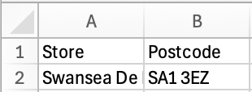

# Geocodio a phoblogaeth {#sec-e03}

> **Dyddiad yr ymarfer:** 16eg Hydref 2026

Mae lleoliad a dwysedd y boblogaeth ddynol yn sail i sut mae cymdeithas wedi'i threfnu. Mae GIS yn helpu i ddeall systemau dynol trwy gyfrifo pethau fel dwysedd poblogaeth, agosrwydd at nodweddion, a neilltuo data i gyfeiriadau. Yn y DU, mae codau post wedi'u datblygu fel ffordd o gysylltu gweithgaredd dynol â lleoliadau ffisegol er mwyn cynorthwyo llywodraethu. Mae'r ymarfer hwn yn archwilio sut y gellir defnyddio codau post i gasglu gwybodaeth ddefnyddiol ar lefel y boblogaeth, a sut y gellir defnyddio QGIS i echdynnu gwybodaeth - ychwanegiad gwerthfawr ar gyfer eich prosiect fferm wynt.

::: {.callout-note}
## Amcanion dysgu

I archwilio dosbarthiad pwyntiau cod post yng Nghymru, archwilio dwysedd poblogaeth, geogodio nodweddion newydd ar fap, a chyfrif poblogaethau o fewn dalgylchoedd syml. Bydd y gallu i echdynnu gwybodaeth o ddata geo-ofodol yn hanfodol ar gyfer capsiynau eich map.
:::

## Archwilio lleoliadau cod post

(@) Lansiwch QGIS a chreuwch prosiect newydd

(@) Ychwanegwch yr haen `Wales_Principal_Areas.gpkg` at eich prosiect

(@) Ychwanegwch yr haen `Wales_headcounts_at_postcodes_2021.gpkg` at eich prosiect. Mae'r set ddata hon yn cynnwys y nifer o dai a phobl sydd wedi'u cofrestru ym mhob cod post (cymerwyd o’r Cyfrifiad 2021), ynghyd â chyfesurynnau o OS OpenData

(@) Ymchwiliwch i'r attributes table ac archwiliwch sut mae'r pwyntiau hyn wedi'u dosbarthu

(@) Gan ddefnyddio sgiliau o Ymarfer 1 ([Adran 1.5](#sec-attrib)) i ateb y canlynol:

```{r}
#| echo: false
#| message: false
#| results: asis
library(exams2forms)
exams2forms("E03_Q1.cy.Rmd", edir = "exercises")
```

(@) Defnyddiwch [Google Maps](https://www.google.com/maps){target='_blank'} i chwilio am y codau post hyn i ateb y canlynol:

```{r}
#| echo: false
#| message: false
#| results: asis
library(exams2forms)
exams2forms("E03_Q2.cy.Rmd", edir = "exercises")
```

(@) Cadwch eich prosiect!

(@) Yn ogystal â gallu dosbarthu pwyntiau yn ôl categori o'r attributes table (fel y gwnaethoch chi yn @sec-filter), gellir graddio pwyntiau gan newidyn parhaus yn seiliedig ar faint neu liw. Gall hyn fod yn dechneg ddelweddu effeithiol iawn. I raddio yn ôl maint:

    i. Agorwch ffenestr `Symbology` yr haen headcounts
    ii. Defnyddiwch y cwymplen i newid ffynhonnell y symboleg o `Single Symbol` i `Graduated`
    iii. Gosodwch `Value` i `Total` (h.y. poblogaeth y DU yn 2021)
    iv. Gosodwch `Method` i `Size`
    v. Cliciwch `Classify` → `OK`

## Darganfod ystadegau headcount {#sec-stats4fields}

(@) Gweithrediad bwerus GIS yw gallu deillio gwybodaeth ystadegol o oll neu is-set o nodweddion mewn set ddata geo-ofodol. Mae hyn yn berthnasol i gyfrifo ystadegau o'ch teils map a lleoliad eich fferm wynt eich hun. I gyfrifo ystadegau ar headcounts fesul cod post:

    i. Cliciwch `Vector` → `Analysis Tools` → `Basic Statistics For Fields...`
    ii. Gosodwch `Input layer` i'r haen `Wales_headcounts_at_postcodes_2021.gpkg`
    iii. Gosodwch `Field to calcualate statics on` i `Total`
    iv. Cliciwch `Run`. Cyflwynir y canlyniadau o dan y tab `Log`, a gellir eu gweld yn y `Results Viewer` drwy dwbl-glicio ar y gwrthrych `Statistics report`
    
(@) Defnyddiwch `Basic Statistics For Fields...` i ateb y canlynol:

```{r}
#| echo: false
#| message: false
#| results: asis
library(exams2forms)
exams2forms("E03_Q3.cy.Rmd", edir = "exercises")
```

(@) Gobeithio eich bod wedi defnyddio `Wales_headcounts_at_postcodes_2011.gpkg` i ateb yr ail gwestiwn! Os felly, cliciwch ar y dde ar haen cyfrif `2011` a chliciwch `Remove Layer...`. Mae'n arfer da gwaredu haenau ar ôl i chi orffen gyda nhw, er mwyn osgoi i'ch prosiect fynd yn rhy orlawn

## Ystadegau yn ôl lleoliad {#sec-selectlocation}

(@) Cyfrifwch ystadegau sylfaenol ar is-set o ddata mewn lleoliad penodol:

    i. Dewiswch bolygon Sir Abertawe o `Wales_Principal_Areas` (wedi anghofio sut i wneud hyn? Gwiriwch [Adran 1.5](#sec-attrib))
    ii. Cliciwch `Vector` → `Research Tools` → `Select By Location...`
    iii. Gosodwch `Select features from` i `Wales_headcounts_at_postcodes_2021`
    iv. Ticiwch `are within`
    v. Gosodwch `By comparing to the features from` i `Wales_Principal_Areas`
    vi. Ticiwch `Selected features only`. Mae hyn yn sicrhau mai dim ond codau post yn Abertawe sy'n cael eu dewis
    vii. Cliciwch `Run`
    viii. Os caiff ei wneud yn gywir, fe welwch fod pob canolbwynt cod post yn Sir Abertawe wedi'i ddewis (wedi'i amlygu'n felyn)

(@) Defnyddiwch yr offeryn `Basic Statistics For Fields...` i ateb y canlynol (**gwnewch yn siŵr bod `Selected features only` wedi'i dicio y tro hwn**):

```{r}
#| echo: false
#| message: false
#| results: asis
library(exams2forms)
exams2forms("E03_Q4.cy.Rmd", edir = "exercises")
```

## Creu gresmap dwysedd poblogaeth

(@) Mae gwresmap yn offeryn delweddu sy'n defnyddio ramp lliw i ddangos gwerthoedd neu dwysedd data gofodol ar ffurf raster gyda maint picsel penodol. Gall rhain grynhoi data pwynt yn effeithiol - efallai'n fwy effeithiol na graddio pwyntiau yn ôl maint. I greu gwresmap o ddwysedd poblogaeth yn Sir Abertawe:

    i. Cliciwch `Processing` → `Toolbox` neu dewch o hyd i'r llwybr byr ({width=3%})
    ii. Cliciwch y saeth chwymplen wrth ymyl `Interpolation`
    iii. Dwbl-gliciwch `Heatmap (Kernel Density Estimation)`
    iv. Gosodwch `Point layer` i `Wales_headcounts_at_postcodes_2021`
    v. Ticiwch `Selected features only`
    vi. Gosodwch `Radius` i `500` metr
    vii. Gosodwch `Pixel size X` a `Pixel size Y` i `100` metr
    viii. Gosodwch `Weight from field` i `Total`
    ix. Cliciwch `Run` → `Close`

(@) Arbrofwch gyda:

    i. Newid symboleg yr haen raster (gweler @sec-rasterdata)
    ii. Creu gwresmap newydd gan newid y `Radius` y tro hwn
    iii. Creu gwresmap newydd ar gyfer Cymru gyfan (Dad-diciwch `Selected features only`..)

(@) Wedi cadw eich prosiect yn ddiweddar?

## Geocodio cyfeiriadau newydd

(@) Geogodio yw'r broses o drosi cyfeiriad neu enw lle i gyfesurynnau daearyddol, fel lledred a hydred. Mae'n caniatáu i GIS blotio lleoliadau ar fap. Mae offeryn 'trosi' o'r fath unwaith eto yn weithrediad pwerus o GIS. Defnyddiwch geogodio i blotio ble mae siopau Tesco lleol Abertawe wedi'u lleoli:

    i. Llywiwch i'r [Lleolydd siop Tesco](https://www.tesco.com/store-locator/){target='_blank'}
    ii. Chwiliwch am siopau yn ardal 'Abertawe'
    iii. Agorwch `Excel`
    iv. Llenwch daenlen gydag enw'r 'Siop' a'r 'Cod Post' ar gyfer y saith siop gyntaf o'r wefan
    v. Cadwch y daenlen mewn fformat `.csv` (mae `UTF-8` yn iawn)

{fig-align='center' width=50%}

(@) Nesaf, gosodwch ategyn penodol i wneud y geocodio. Mae ategion yn cael eu hysgrifennu gan ddatblygwyr QGIS a datblygwyr annibynnol eraill sydd eisiau ymestyn swyddogaeth graidd y feddalwedd. Yr arloesi hwn dan arweiniad y gymuned sy'n gwneud QGIS yn offeryn mor bwerus. I osod ategion:

    i. Dychwelwch i QGIS
    ii. Dewiswch `Plugins` → `Manage and Install Plugins...` 
    iii. Chwiliwch am `mmqgis`
    iv. Dewiswch yr offeryn `mmqgis`
    v. Cliciwch `Install Plugin`
    vi. Cliciwch `Close`

(@) Defnyddiwch yr offeryn `MMQGIS` i atodi cyfesurynnau i ddata cod post:

    i. Cliciwch `MMQGIS` → `Geocode` → `Geocode CSV with Web Service`
    ii. Gosodwch `Input CSV File` fel eich ffeil .csv
    iii. Gosodwch `Cyfeiriad` fel eich colofn cod post
    iv. Gosodwch `Web Service` fel `OpenStreetMap / Nominatim`
    v. Gosodwch `Output File Name` i'ch ffolder `Downloads`
    vi. Gosodwch `Not Found Output List` i'ch ffolder `Downloads`
    vii. Cliciwch `Apply`
    viii. Arhoswch nes bod `Geocoded 7 of 7` yn ymddangos o dan yr offeryn a gwiriwch fod y codau post yn ymddangos yn y lleoedd cywir
    ix. Cliciwch `Close`

::: {.callout-important} 
## Allbwn dros dro {#sec-tempout}

Mae'n gyffredin yn QGIS i greu haenau dros dro, i wirio eu bod yn arddangos fel y bwriadwyd, yna arbed yr allbwn i rywle mwy synhwyrol. Mae hyn yn arbennig o wir os oes sawl cam (ac felly haenau y mae angen eu creu) i gyrraedd yr allbwn terfynol a fwriadwyd. Mae arbed yr haenau dros dro hyn i'ch ffolder 'Downloads' yn syniad da, gan y gallwch chi wagio'r ffolder hon yn y pen draw heb rwystro lle gwerthfawr ar eich cyfrif OneDrive gyda data sothach.
:::

## Allforio haenau fector {#sec-export}

(@) Addaswch yr haen fector dros dro a'i chadw mewn lleoliad synhwyrol:

    i. O'r panel `Layers`, dde-gliciwch ar `temp1` 
    ii. Cliciwch `Export` → `Save Features As...`
    iii. Gosodwch `Format` i `GeoPackage`
    iv. Dewiswch leoliad addas i gadw'r geopackage
    v. Gosodwch 'Layer name' fel rhywbeth synhwyrol, e.e. yr un fath â'r enw ffeil
    vi. Gosodwch `CRS` i `EPSG:27700`
    vii. O dan `Select fields to export and their export options`, gallwch benderfynu pa wybodaeth ddylai ymddangos yn y attributes table. Cadwch bethau'n daclus trwy gynnwys enw'r siop a'r cod post yn unig
    viii. Cliciwch `OK`

(@) Dylai'r haen ymddangos yn y panel `Layers`. Agorwch ei attributes table. A yw'r hyn rydych chi newydd ei wneud yn gwneud synnwyr? Os na - gofynnwch!

(@) Gwaredwch yr haen `temp1` o'ch prosiect

## Defnyddio byfferau fel dalgylchoedd syml {#sec-buffers}

(@) Mae creu byfferau o amgylch nodweddion i'w defnyddio fel dalgylchoedd neu barthau gwaharddedig yn enghraifft bwerus arall o gymhwysiad GIS. Fel enghraifft, darganfyddwch faint o bobl sy'n byw o fewn pellter cerdded i'r siopau Tesco rydych chi wedi'u geogodio. Crëwch fyfferau o amgylch pob pwynt cod post i frasamcanu'r pellter cerdded o'r siop Tesco:

    i. Cliciwch `Vector` → `Geoprocessing Tools` → `Buffer...` 
    ii. Gosodwch `Input layer` fel eich haen siopau Tesco (a ddylai nawr gynnwys `[EPSG:27700]` ar ôl enw'r haen)
    iii. Gosodwch `Distance` i `500` metr
    iv. Ticiwch `Dissolve result`
    v. Cliciwch `Run` → `Close`

(@) Gan ddefnyddio `Select by Location` (gweler @sec-selectlocation) a `Basic Statistics` (gweler @sec-stats4fields), dewch o hyd i gyfanswm y bobl sydd wedi'u cofrestru i godau post o fewn 500 m i siopau Tesco

(@) Ar gyfer yr her olaf, atebwch y canlynol (awgrym: gweler @sec-filter):

```{r}
#| echo: false
#| message: false
#| results: asis
library(exams2forms)
exams2forms("E03_Q5.cy.Rmd", edir = "exercises")
```

::: {.callout-note}
## Canlyniadau dysgu

Erbyn diwedd yr ymarfer hwn dylech chi allu:

1. Archwilio ddata cyfrifiad sy'n gysylltiedig â chod post drwy'r attributes table, gan archwilio ac egluro patrymau gofodol dwysedd poblogaeth uchel ac isel
2. Delweddu dwysedd poblogaeth gan ddefnyddio symboleg raddedig ac amcangyfrif dwysedd kernel (gwresmap)
3. Geogodio gyfeiriadau o godau post gan ddefnyddio ategyn a gwasanaeth gwe, ac allforio'r canlyniad fel haen fector wedi'i thaflunnu'n gywir
4. Cyfrifo ystadegau poblogaeth ar gyfer ardaloedd a dalgylchoedd diffiniedig gan ddefnyddio’r offer `Select by Location`, `Buffer`, a `Basic Statistics for Fields`
5. Gwerthfawrogi sut mae codau post yn cysylltu gweithgaredd dynol â lleoliad ffisegol, a gwerth data taclus, deniadol a haenau dros dro mewn llif gwaith GIS - a'ch prosiect fferm wynt
:::
