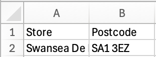
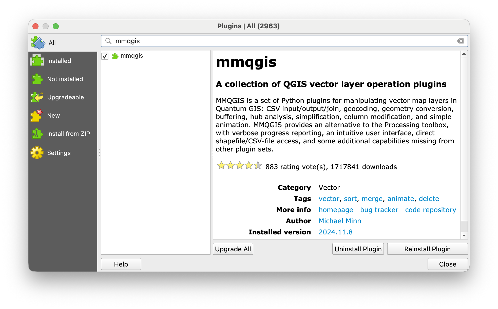
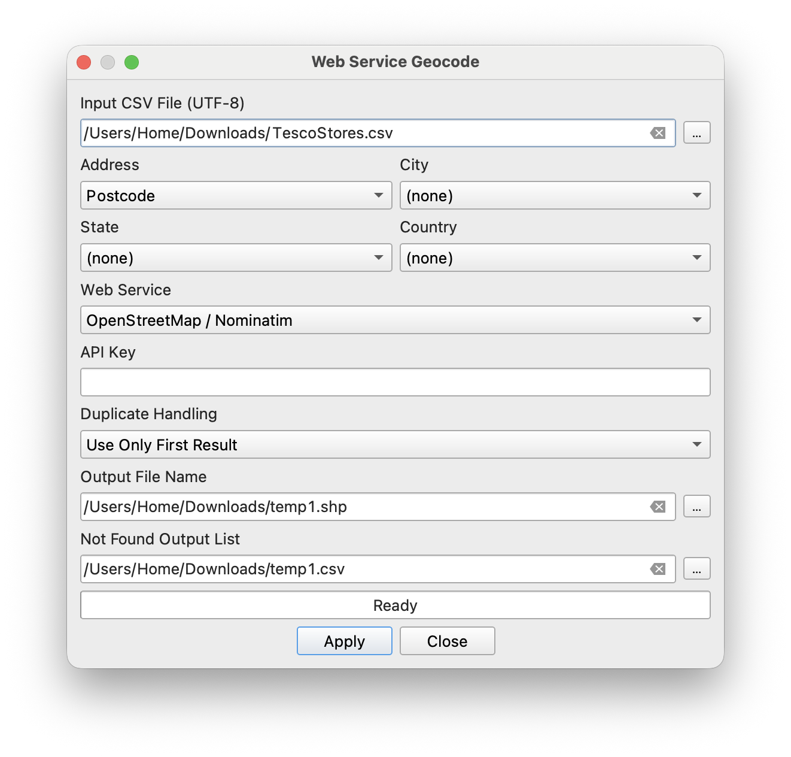
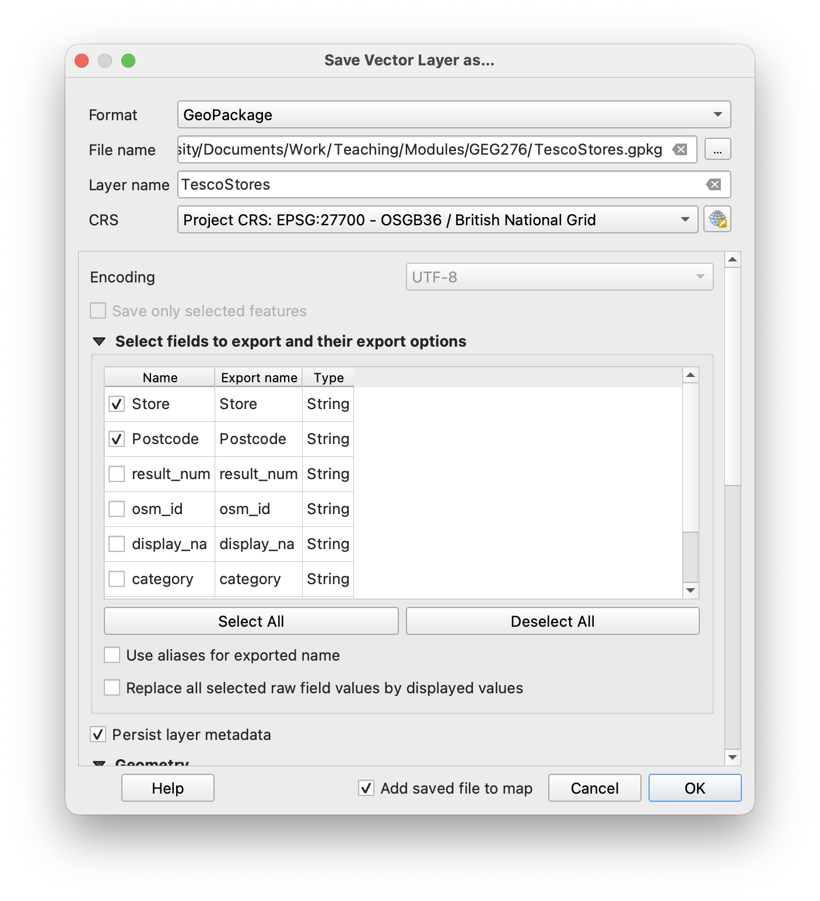
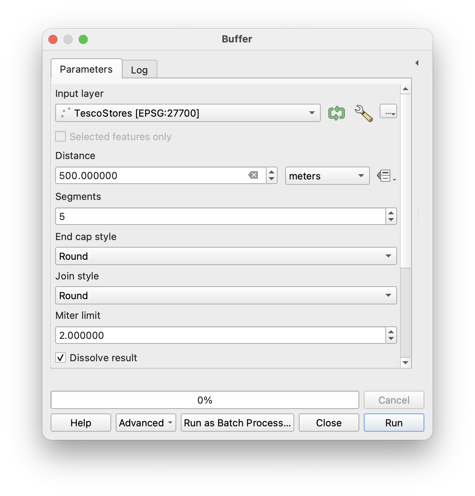

# Geocoding and population {#sec-e03}

> **Date of practical:** 16th October 2025

The location and density of the human population underpin how society is organised. GIS helps one understand human systems, by calculating things like population density, proximity to features, and assigning data to addresses. In the UK, postcodes have been developed as a means to link human activity to physical locations for aiding governance. This exercise explores how postcodes can be used to gather useful population-level information.

::: {.callout-note}
## Learning aims

To examine the distribution of postcode reference points within Wales, visualise population density, geocode new features onto a map, and count populations within simple catchments.
:::

## Exploring postcode locations

(@) Launch QGIS and create a new project

(@) Import the `Wales_Principal_Areas.gpkg` layer

(@) Import the `Wales_headcounts_at_postcodes_2021.gpkg` layer. This dataset contains the number of households and people registered at each postcode (taken from the 2021 Census), combined with coordinates from OS OpenData

(@) Investigate the attribute table and explore how these points are distributed

(@) Using the attribute table, examine areas of very high and very low density and discuss with your neighbour why these spatial patterns may exist

(@) Using attribute table selection and skills from Chapter 1 (@sec-attrib), find postcodes with the greatest number of people in the Cardiff (`CF`), Swansea (`SA`) and Aberystwyth (`SY`) areas 

(@) Use [Google Maps](https://www.google.com/maps){target='_blank'} to search for these postcodes, and discuss with your neighbour why these locations have such high population counts

(@) Save your project!

(@) Open the headcounts layer's `Symbology` window

(@) Use the drop-down menu to change the symbology source from `Single Symbol` to `Graduated`

(@) Set `Value` to `Total` (i.e. the UK population in 2021)

(@) Set `Method` to `Size`

(@) Click `Classify` → `OK`. Point sizes should now reflect population per postcode

## Finding headcount statistics {#sec-stats4fields}

(@) Click `Vector` → `Analysis Tools` → `Basic Statistics For Fields...`

(@) Set `Input layer` to the `Wales_headcounts_at_postcodes_2021.gpkg` layer

(@) Set `Field to calcualate statics on` to `Total`

(@) Click `Run`. Results are presented under the `Log` tab, and can be viewed in the `Results Viewer`. Double-clicking `Statiscs` will open the results in a web browser

(@) Consider what each value means, then discuss with your neighbour what the registered population of Wales in 2021 was (a sense check on google may help!)

(@) Click `Close`

(@) Calculate the percentage population change in Wales between 2011 and 2021. Show off by being first to tell your neighbour the result

(@) Right-click on the `2011` census headcount layer and click `Remove Layer...`

::: {.callout-tip}
# Keeping things tidy

It's good practice to remove layers once you're done with them, to avoid your project becoming too cluttered and confusing.
:::

## Select by location {#sec-selectlocation}

(@) Calculate basic statistics on a subset of data in a particular location:

    i. Select the Swansea county polygon from `Wales_Principal_Areas` (forgotten how to do this? Check @sec-attrib)
    ii. Click `Vector` → `Research Tools` →  `Select By Location...`
    iii. Set `Select features from` as `Wales_headcounts_at_postcodes_2021` 
    iv. Check `are within`
    v. Set `By comparing to the features from` to `Wales_Principal_Areas`
    vi. Check `Selected features only`. This ensures only postcodes in Swansea are selected
    vii. Click `Run`
    viii. If done correctly, you'll see all postcode centroids in Swansea county have been selected (highlighted yellow)

(@) Use the `Basic Statistics For Fields...` tool to find the 2021 `Total` population of Swansea. **Make sure `Selected features only` is checked this time** 

(@) Calculate the 2021 population of Cardiff county, and calculate the percentage population change in Swansea county between 2011 and 2021. Show off again by beating your neighbour in finding the results

## Creating a heatmap

(@) Click `Processing` → `Toolbox` or find the the shortcut ({fig-align='center' width=25%})

(@) Click the drop-down arrow next to `Interpolation`

(@) Double-click `Heatmap (Kernel Density Estimation)`

(@) Generate a raster heatmap of population density across Wales:

    i. Set `Point layer` to `Wales_headcounts_at_postcodes_2021`
    ii. Set `Radius` to `500` metres
    iii. Set `Pixel size X` and `Pixel size Y` to `100`
    iv. Set `Weight from field` to `Total`

(@) Experiment with the raster layer's symbology (see @sec-rasterdata). It may help to hide the 2021 point layer and clear any selections from the principal areas polygons whilst you do this

(@) Experiment with changing the `Radius` to see how the heatmap changes

(@) Saved your project recently?

## Geocoding new addresses

::: {.callout-tip}
# What's geocoding?

Geocoding is the process of converting a human-readable address or place name into geographic coordinates, such as latitude and longitude. It allows a GIS to plot locations on a map. Let's do some geocoding by plotting where your local Tesco stores are located!
:::

(@) Navigate to the [Tesco store locator](https://www.tesco.com/store-locator/){target='_blank'}

(@) Search for stores in the `Swansea` area

(@) Open `Excel` 

(@) Populate a spreadsheet with the `Store` name and `Postcode` of the first seven stores from the website

{fig-align='center' width=50%}

(@) Save the spreadsheet in a `.csv` format (`UTF-8`)

(@) In QGIS, select `Plugins` → `Manage and Install Plugins...` 

::: {.callout-tip}
# The power of plugins

Plugins are written by QGIS developers and other independent developers who want to extend the core functionality of the software. It is this community-led innovating that makes QGIS such a powerful tool.
:::

(@) Search for `mmqgis`

(@) Click `Install Plugin`

{fig-align='center' width=50%}

(@) Use the `MMQGIS` tool to attach coordinates to postcode data:

    i. Click `MMQGIS` → `Geocode` → `Geocode CSV with Web Service`
    ii. Set `Input CSV File` as your .csv file 
    iii. Set `Address` as your postcode column
    iv. Set `Web Service` as `OpenStreetMap / Nominatim` 
    v. Set `Output File Name` to your `Downloads` folder
    vi. Set `Not Found Output List` to your `Downloads` folder
    vii. Click `Apply`
    viii. Wait until `Geocoded 7 of 7` appears beneath the tool and check the postcodes appear in the correct places
    ix. Click `Close`
    
{fig-align='center' width=50%}

::: {.callout-important}
# Temporary output

It's common in QGIS to create temporary layers, check they're displaying as intended, then save the output to somewhere more sensible. This is especially true if several steps are needed to create the intended output. Saving these temporary layers to your `Downloads` folder is a good idea, as you can eventually empty this folder without glogging up valuable space on your OneDrive account with junk data.
:::

## Exporting vector layers

Modify the temporary vector layer and save in a sensible location:

    i. From the `Layers` panel, right-click on `temp1` and click `Export` → `Save Features As...`
    ii. Set `Format` to `GeoPackage`
    iii. Select a suitable location to save the geopackage 
    iv. Set 'Layer name' as something sensible, e.g. the same as the file name
    v. Set `CRS` to `EPSG:27700`
    vi. Under `Select fields to export and their export options`, you can decide what information should appear in the attribute table. Keep things tidy by only including the store name and postcode
    vii. Click `OK`

{fig-align='center' width=50%}

(@) The layer should appear in the `Layers` panel. Open its attribute table. Does what you've just done make conceptual sense? If not - ask!

(@) Remove the `temp1` layer from your project

## Using buffers as simple catchments

(@) Create buffers around each postcode point to approximate walking distance from the Tescos store:

    i. Click `Vector` → `Geoprocessing Tools` → `Buffer...` 
    ii. Set `Input layer` as your Tesco stores layer (which should now have `[EPSG:27700]` after the layer name)
    iii. Set `Distance` to `500` metres 
    iv. Check `Dissolve result`
    v. Click `Run` → `Close`

{fig-align='center' width=50%}

(@) Using `Select by Location` (see @sec-selectlocation) and `Basic Statistics` (see @sec-stats4fields), find the total number of people registered to postcodes within 500 m of Tesco stores

(@) For the final challenge - find the total number of people registered in 2021 within 2 km of Swansea University Singleton Campus (SA2 8PQ) and Bay Campus (SA1 8QE).

The skills you've learned here are vital for the wind farm project.

::: {.callout-note}
# Learning outcomes

By the end of this exercise you should be able to: 

1. Explore postcode-linked census data through the attribute table, examining and explaining spatial patterns of high and low population density
2. Visualise population density using graduated symbology and kernel density (heatmap) estimation
3. Geocode addresses from postcodes using a plugin and web service, and export the result as a properly projected vector layer
4. Calculate population statistics for defined areas and catchments — combining `Select by Location`, `Buffer`, and `Basic Statistics for Fields` tools
5. Appreciate how postcodes link human activity to physical location, and the value of tidy, well-projected data and temporary layers in a GIS workflow
:::
