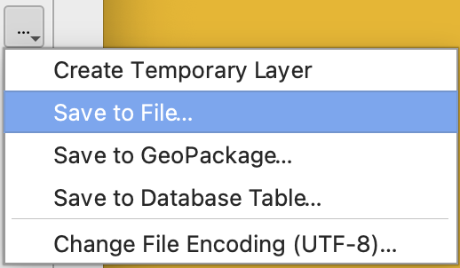

# Combining vector layers {#sec-e04}

Creating spatial and thematic subsets of vector layers is essential GIS practice. It is through the manipulation and combination of spatial datasets that we generate new information - such as where to site a wind farm.

**This exercise will guide you through the requirements for making Map 2**

::: {.callout-note}
## Learning aims

To clip small subsets from large vector datasets, create dissolved buffers around line and polygon layers, select subsets by attribute, and combine layers.
:::

## Investigating your map tile

(@) Launch QGIS and create a new project

(@) From the `UK_Boundaries` folder, add the `Wales_border.gpkg` layer to your project

(@) From the `Wales_map_tiles` folder, add your assigned OS map tile to your project. This layer is where your wind farm project will focus

::: {.callout-hint}
## Map tiles

Your assigned map tiles can be found [here](https://www.tesco.com/store-locator/){target='_blank'}.
:::

(@) Calculate the area of your map tile in square kilometres. Need reminding of how to do this? See @sec-measuring

(@) Calculate the perimeter of your map tile in kilometres

(@) Open the attribute table for your map tile. This layer has one polygon, so there's only one row in the table

#### Field calculator {#sec-fieldcalc}

(@) Open the Field Calculator ({width=3%}). The field calculator is a powerful tool that lets you create new attribute fields or update existing ones using fast mathematical, geometric, and conditional expressions.

(@) Calculate the area of your tile:

    i. In `Output field name` type `Area`
    ii. Set `Output field type` as `Decimal number (real)`
    iii. In the central panel, expand the `Geometry` drop-down menu
    iv. Double-click `$area`
    v. Click `OK`

(@) Calculate the `$perimeter` of your map tile. Now these values have been saved in the attribute table, what units are these in? Note that the values are slightly different from what you should have expected. This is because the curvature of the Earth introduces a small distortion between real and mapped areas

(@) From everything you learnt in @sec-e03, calculate the number of people living within your polygon at the 2021 Census

(@) Using the area measurement you calculated above, compute population density for your tile

## Clip

(@) Add all the layers in the `Wales_protected_areas` folder to your project

(@) Explore these layers and their attributes. Is it obvious what is meant by 'protected areas'? Find more information about these datasets [here](https://en.wikipedia.org/wiki/Protected_areas_of_Wales){target='_blank'}.

(@) Save your project!

(@) Clip each protected area layer so they appear within your map tile:

    i. Click `Vector` → `Geoprocessing Tools` → `Clip...`
    ii. Set `Input layer` to one of the protected areas layers - let's start with `NRW_AONB`
    iii. Set `Overlay layer` to your map tile
    iv. Click `Run` → `Close`
    
::: {.callout-warning}
## Temporary scratch layers

You'll now see a new layer called `Clipped` with a memory chip icon ({width=3%}) next to it. This means the layer is temporary. If you close QGIS now, you will lose this layer! So, shall we make it permanent? Well, we want to clip all the protected areas layers to the map tile, then combine into a single 'protected areas' layer (see steps below). So it's fine to amass these temporary layers to get to the final desired layer, then remove them all without saving 'junk' data. This came up in the last exercise (see @sec-tempout).
:::

(@) Rename the `Clipped` layer to something more intuitive (e.g. `NRW_AONB_Clipped`). It is important to rename temporary layers as you go, otherwise you'll inevitably get confused over which layers represent what 

(@) Clip the remaining protected area datasets to your map tile. You only need to clip those layers that actually have features in your area, so inspect the layers first to find out if this is the case

### Merge {#sec-merge}

(@) Merge the clipped layer to create a single 'protected area' layer:

    i. Click `Vector` → `Data Management Tools` → `Merge Vector Layers...`
    ii. Under `Input layers`, click the `Browse` icon ({width=3%}) and check all the clipped layers
    iii. Click `OK`
    iv. Set `Destination CRS` to `EPSG27700`
    v. Click `Run` → `Close`

::: {.callout-hint}
## The Dissolve tool

Combining polygons often leaves behind boundaries within the output which no longer represent the new polygon edge. These may even complicate further processing steps. It is good practice to remove these internal boundaries using the `Dissolve` tool.
:::

### Dissolve {#sec-dissolve}

(@) Dissolve internal boundaries of the merged layer:

    i. Click `Vector` → `Geoprocessing Tools` → `Dissolve...`
    ii. Under `Input layer`, select your merged layer
    iii. Click `Run` → `Close`

(@) Now we have the final product derived from a series of processing steps, it's time to export the layer. Remind yourself of how to do this here: @sec-export

(@) Use the field calculator to find total protected area. Calculate percentage of your tile. No canvas quiz this time - this might be a useful piece of information to present in a caption!

::: {.callout-hint}
## Being efficient

Why not merge everything first, then clip and dissolve? Whilst that's easier for us, it's harder for the PC to merge multiple large-scale datasets. Clipping each layer individually then merging is actually more efficient for the PC. This means runtimes are faster.
:::

(@) Locate and add the operational (existing or planned) wind farms layer to your project

(@) Clip this layer to your map tile. Note that there may be none in your map tile

(@) Have you been saving your project?

::: {.callout-hint}
## Efficient filing

This is a good time to remind you to be careful and tidy about where to save GIS output – you will be generating many files for this project and a hierarchical folder structure and carefully named layers is highly recommended. Be methodical in how you
name layers and where you put them – you will need to find and use them later on.
:::

## Clipping line layers and adding buffers

(@) From the `British_Isles_geofabrik/wales` folder, add the `gis_osm_waterways_free_1.gpkg`, `gis_osm_water_a_free_1.gpkg`, `gis_osm_railways_free_1.gpkg`, and `gis_osm_roads_free_1.gpkg` layers to your project

(@) Explore these layers' attributes

(@) Clip each of these layers to your tile. This time, try saving each clipped layer directly to your OneDrive account. It is up to you whether you prefer saving output directly, or if you'd rather create temporary layers to inspect before making them permanet. 

{fig-align='center' width=25%}

(@) Review the Windfarm Project instructions and @sec-constraints and begin to:

    i. @sec-addlayers all the necessary layers to your project
    ii. Use @sec-buffer to find which parts of your map tile should not be built upon
    iii. @sec-clip, @sec-merge, and @sec-dissolve any orginial or modified layer as required
    iv. @sec-save your layers in sensible, well-organised file structure

Think carefully about the order in which you buffer, clip, dissolve, merge etc. Would clipping at the end of your workflow remove trailing bits generated by your buffer, for example (:egg:)? Experimentation is encouraged! You will find efficient and inefficient ways of doing things, and your learning really develops when you play around, mess up, and try again.

## Selecting elements by attribute {#sec-selexpress}

(@) From the `British_Isles_geofabrik/wales` folder, add the `gis_osm_landuse_a_free_1.gpkg` layer to your project

(@) Clip the layer to your map tile

(@) Open the layer's attribute table

(@) Click `Select features using an expression` ({width=3%})

(@) Expand `Fields and Values`

(@) Click `fclass` → `All Unique`. All unique categories in the `fclass` layer (i.e. all the unique land use classes) are now listed

(@) Decide which classes are relevant (again, refer to @sec-constraits)

(@) Under `Expression`, type `"fclass" = 'residential'`. You can also double-click on the fields, values, and symbols (e.g. {width=3%}) names to build the expression

(@) Click `OK`

::: {.callout-hint}
# Singles or multiples?

You may recognise this type of coding - you did in @sec-filter (`"fclass" IN ('primary', 'trunk', 'motorway'`). Well, the logic is the same. But reflect carefully on whether extracting all layers into a single 'landuse' layer is helpful, or if you want to be able to distinguish between the different layers. Review the windfarm project conditions carefully to decide.
:::

(@) Export the selected polygons (remember to use the `Save Selected Features As...` option). Name and store methodically.

(@) Repeat for all other relevant land use classes.

## Taking stock of planning constraints

(@) By this point you should have a set of data layers which together represent those parts of your map tile unsuitable for windfarm development because of their position within, or proximity to, man-made or natural features of the landscape. Consider how best to present these on a map as part of your Project. Remember to think about the purpose and audience, and the need to justify your thinking

::: {.callout-tip}
# Learning outcomes

By the end of this exercise you should be able to:

1. Use the field calculator to derive geometric attributes (area, perimeter) and compute values such as population density for a map tile.
2. Clip features from large vector datasets to a defined area of interest, retaining only the data relevant to the analysis.
3. Combine multiple clipped layers into a single dataset by merging and dissolving internal boundaries to produce clean output.
4. Create dissolved buffers around line and polygon features to represent zones of constraint or proximity.
5. Select features by attribute using expressions, and organise the resulting layers methodically within a well-structured file system.
:::
