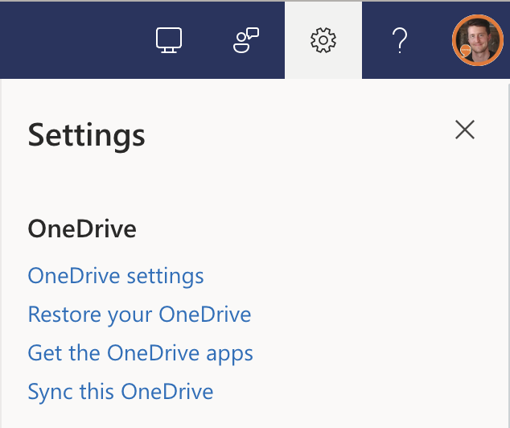

# Before you begin {.unnumbered}

This chapter will help you build practical skills, avoid common pitfalls, and make the most of your time in the computer lab. You can work at your own pace, but it is important to attend all scheduled computer practicals. These sessions are your chance to share your progress, ask questions, and clear up misunderstandings in a supportive, flipped-learning environment [@Dikilitas2023]. By the end of this chapter, you'll be better prepared to complete the exercises efficiently and confidently.

## Accessing QGIS

There are a number of ways to access QGIS:

::: panel-tabset
## University computer

QGIS can be accessed from any computer around campus:

1. Use the ZenWorks window to navigate to `Science → Geography` 

2. Double-click the `QGIS` icon

## Personal computer

QGIS is free, open-source software available for Windows, Mac, and Linux. This means you’re not limited to using University computers. You can install it on your own machine and work wherever and whenever you like:

1. Download and install QGIS [here](https://www.qgis.org/download/){target='_blank'}

2. Double-click on the downloaded folder to start the installation. For Mac users, right-click on the folder and click `Open` to start the installation

::: callout-tip
I recommend installing the `Long Term Release` version of QGIS which, in theory, has fewer bugs in it. Download `Latest Release` for the most up-to-date features.
:::

## Remote Desktop

The **Remote Desktop** allows you to log into one of the University’s Open Access computers from home. Once connected, you will have the same access to software and data as if you were physically on campus — including the Student Common L:drive (`L:/College of Science/Geography/GEG276`).

::: callout-note
The number of simultaneous Remote Desktop connections is capped, so you may not always be able to log in.
:::

Using the Remote Desktop requires:

* Multi-Factor Authentication (MFA); a second security step in addition to your password.
* The Microsoft Authenticator app installed on a smartphone.
* VPN access (see the University IT guidance).

To set up MFA for Remote Desktop:

1. Download the **Microsoft Authenticator App** from your app store.
2. Go to the [MyUni hub](https://myuni.swansea.ac.uk/){target='_blank'}.
 and log in.
3. Click **My Apps**.
4. Select **Secure my Account** (bottom right).
5. Choose **Add method** (above your phone number).
6. Set **Authenticator App** as your default authentication method.
7. Enter the code you are sent by text message.
8. Click **Next** to continue.
9. Scan the QR code displayed on screen with your Authenticator App.

If the setup doesn't work the first time, repeat the steps carefully to confirm each stage is complete. If you are still experiencing issues, please follow the online tutorials at [Remote PC Access Service](https://myuni.swansea.ac.uk/it-services/remote-pc-access-service/){target='_blank'} and [Account Enquiry and MFA Setup](https://myuni.swansea.ac.uk/it-services/account-enquiry/){target='_blank'}, request support from the IT team using the [Service Centre](https://swanseauniversity.service-now.com/sp?id=sc_cat_item&sys_id=3f1dd0320a0a0b99000a53f7604a2ef9){target='_blank'}, or contact me for guidance.

:::

## Accessing the data {#sec-data}

(@) **Check this works: Go to OneDrive on the web (onedrive.live.com or your work/school portal). Navigate to Shared in the left sidebar, then find the folder shared with you
Open the folder and click Sync in the top toolbar. This will download and sync the folder to your PC, and it'll appear in File Explorer under your OneDrive section**

{fig-align='center' width=50%}

<!--

All the datasets you need for the practicals and the final project are provided on the Student Common L:drive:

`L:/College of Science/Geography/GEG276`

If you prefer to work on your own computer, you will need to copy these datasets to your personal computer. You can do this in one of two ways:

1. **Transfer from the L:drive:** Use a USB storage device or a cloud storage service such as Microsoft OneDrive or Google Drive to copy the relevant files from the L:drive.

2. **Download from Google Drive:** Copy the relevant files using the link [here](https://drive.google.com/drive/folders/1n8jng_fFgCJ22vY-W9khlk4hEdKQg-CP?usp=sharing){target='_blank'}. 

To save time and space, only download or copy the data you need for each exercise rather than transferring everything at once.

-->

## Data storage

Swansea University provides secure storage through OneDrive and network drives. These appear the same no matter which University computer you log into, and you can also access OneDrive from your own devices. I have two key tips for you:

* **Always save your work to OneDrive.** This keeps it safe from accidental loss and accessible wherever you are. Avoid storing coursework on the local C: drive. Files saved there are only available on that one machine and may be deleted automatically overnight.

* **Be organised.** Create a clear folder structure for your GIS work and name files logically. GIS projects can generate hundreds of files. Staying tidy will save you time and frustration later.

## Watch your storage space

If your disk space becomes full, QGIS and other software can crash. To remedy this:

1.	Check available space by right-clicking your OneDrive network in Windows Explorer and clicking `Properties`

2.	Delete temporary or unwanted files to free up space

If problems persist (e.g. you can’t log in, access software, or save files), make a Service Centre request [here](https://swanseauniversity.service-now.com/sp?id=sc_cat_item&sys_id=3f1dd0320a0a0b99000a53f7604a2ef9){target='_blank'}.

## GIS software options

Two software applications presently dominate the GIS market, each with benefits and drawbacks:

1. **ESRI ArcGIS Pro.** ArcGIS Pro has been the industry leader for decades and is widely used by professionals.  

**Pros:** Well established, feature-rich, and supported by extensive online documentation. 
**Cons:** Software is licensed and expensive.

2. **QGIS (Quantum GIS).** QGIS is an open-source application that has grown rapidly in popularity, especially in the public sector.  

**Pros:** Free to install, open source, and increasingly competitive with ArcGIS. 
**Cons:** Still lacks some advanced functions and may be less common in certain job markets.

As a Geography Department, we’ve chosen to teach you `QGIS`. Why? Because it combines the power and flexibility of professional GIS with the accessibility and freedom of open-source software.

QGIS is free to install on your own computer, meaning you can practise and experiment anywhere, anytime, without relying on campus labs or expensive licences. It has a clean, intuitive interface that many beginners find easier to learn than ArcGIS, yet it still offers advanced tools used by professionals around the world.

Beyond the classroom, QGIS is rapidly gaining ground in government, consultancy, and research sectors, particularly where budgets are tight and data-sharing is important [@Graser2025]. Its open-source nature means new features and plugins are added by a global community of GIS experts. You’re therefore learning with a platform that’s evolving at the cutting edge.

Mastering QGIS now gives you a career-ready skillset, the ability to collaborate internationally without licence barriers, and the confidence that you can always access a powerful GIS toolkit long after graduation.

## Developing your computer skills

The most effective way to learn GIS is to use it. The practical exercises are designed to guide you through the most common functions in QGIS, helping you build skills and create results you can use in your coursework, projects, or dissertation.

Here are my protips for learning QGIS:

1. **Expect to make mistakes and repeat steps.** This repetition will help you remember processes. QGIS can occasionally hang or crash. Learn to recover quickly by saving often and keeping track of your progress. 

2. **Save your work regularly and know exactly where it is stored.** Keep a tidy, logical folder structure, and make copies of work that has taken a long time to achieve. GIS creates many files, and good organisation will save time and prevent data loss.

3. **Explore the software rather than only following instructions.** Be bold and click through menus, try tools, and experiment. You will learn faster by discovering features yourself. The practical exercises will expect you to find some things out for yourself.

4. **Ask for help when needed.** Support is available through Canvas video demos, classmates, demonstrators, and online resources. Coursework must be completed individually, but collaboration on problem-solving is encouraged.

## QGIS basics

### Windows, panels, and toolbars

QGIS has two main windows: the `Map Canvas` and `Print Layout`. Within each window, you can open a number of toolbars (located along the top or left of each window by default) and panels (such as the `Attribute Table` to view and edit data linked to map features). You need to become familiar with opening and interacting with these main program elements.

{fig-align='center'}

### Layers

A layer is a dataset of a single type — vector or raster — loaded into QGIS from (often multiple associated) files saved on your network. Layers are combined to create maps or are processed to produce new layers. Layer order matters because higher layers can hide lower ones.

### Projects

A QGIS project file (`.qgz`) stores references to your data and display settings, but doesn't store the data itself. Projects therefore contain virtual links to all of the data files you've loaded, as well as instructions to the software as to how they should be displayed. This leads to three important considerations:

1. **Moving QGIS projects.** Copying or transferring a QGIS project from one computer to another would require copying the project file and all associated data layers in such a way as to maintain the relative file paths (the path to your data the QGIS project needs to load them). This is sometimes difficult to achieve. If you change your computer environment (e.g. from the University system to your laptop), it is often easier simply to copy all of the layer files and start a new project from scratch.

2. **Moving or renaming data layers.** Changing data layers (or the folders that contain them) will mean a QGIS project can no longer find them and so will fail to open them. It is possible to recover from this situation, but it's easier to avoid in the first place. All data files on the master OneDrive will remain where they are. Make sure that all data files that you put on your OneDrive (or memory stick or laptop disk) are named sensibly and placed in an appropriate folder structure so that you don't accidentally move, rename, or delete them. You will probably generate many hundreds of data files by downloading (e.g. from the internet), copying (e.g. from OneDrive), or creating layers in the course of GIS processing.

3. **Working with temporary layers.** When you create a new GIS layer (e.g. by performing a geoprocessing function on an existing layer), you are normally presented with the option of creating a temporary layer or saving the new layer to disk. Creating temporary layers is a quick way of exploring and confirming the output is what you wanted. However, these layers will no longer be available when you close the project unless you make them permanent. I recommend that use temporary layers for experimentation, and choose a permanent name, location, and data type for any layer that you will need later on.

### Plugins

The basic installation of QGIS is adequate for most purposes, however the GIS practical exercises here go a bit beyond this basic functionality. Many QGIS add-ons have been developed through open source software development and made freely available through the `Plugins` interface. Plugins are installed in the user part of the computer storage so require no administrator privileges. You are encouraged to explore all available plugins. The practical exercises will explain when certain plugins need to be installed.

## Key considerations

### Printing maps

Printed colours often look different from the colours you see on screen. If you need to print a map, always check that your chosen colours work well on paper. The best way to check this is to print a test copy, inspect it closely to make sure all map elements are clear and distinguishable, and adjust the colours if necessary. You may need to repeat this process a few times to get the result you want. Fortunately, all GEG276 coursework (and most assignments in other modules) is submitted online, so printing is rarely essential. Printers also usually cannot print right to the edges of the paper. If you plan to print directly from QGIS, leave at least a 0.5 cm margin around your map to avoid cutting off important details.

### Using transparency

Transparency can help combine multiple layers without losing important details, but it can also make map colours inconsistent with the legend. Avoid partial transparency in final maps for coursework unless it adds essential meaning. Colours in the legend should match those in the map exactly.

### GIS file types

There are several GIS file types. For raster data, I recommend saving them as GeoTIFF (`.tif`). For vector data (points, lines, or polygons), I recommend saving them as GeoPackage (`.gpkg`). You will likely come across Shapefiles as a format for storing vector data. This format has been around since the 90s and remains in wide use today. I recommend using GeoPackages instead for two reasons:

1. **Efficient storage.** A shapefile stores data as a number of files (between 3 and 16!) which have the same name but different extensions (`.shp`, `.shx`, `.dbf`...). If you rename or share a shapefile, you need to make sure that you rename all files and share all files for the new version to work correctly.

2. **Flexible storage.** A shapefile can only be a point, line, or polygon per file. A GeoPackage can store multiple data types.

### GIS data sources

Use reputable sources for GIS data. In the UK, Ordnance Survey (OS) provides authoritative datasets, some of which are free via [OS OpenData](https://www.ordnancesurvey.co.uk/opendatadownload/products.html){target="_blank"}. As a Swansea University student, you can also access premium OS data through [EDINA Digimap](https://digimap.edina.ac.uk/){target="_blank"}. Open data projects like [OpenStreetMap](https://www.openstreetmap.org){target="_blank"} offer free, continuously updated alternatives that are widely used in research and community projects. These data are continuously improving in quality and coverage and anyone can get involved in the project. I’ve chosen to use only Open Data sources for the practical exercises and project so that there are no restrictions on sharing data.

### Customising the Map Canvas (advanced)

If you're like me and you like a nice minimalist and clear interface to work with, one can customise the QGIS Map Canvas to a high degree. If you wish to do this, I recommend you explore the QGIS Documentation at your leisure [here](https://docs.qgis.org/3.40/en/docs/user_manual/introduction/qgis_configuration.html){target='_blank'}. **But be careful!** You may end up removing particular tools or menus that are essential for the completion of this course. So I recommend you only experiment with customisation after you've completed the course.

## Getting help {#sec-gethelp}

For general information, please refer to the GEG276 Canvas site. All documents associated with the course will be posted there, and I may use the Canvas Discussion Board to share extra information. If you don’t find what you're looking for, feel free to email me. If I receive a query (the answer to which may be useful to all students), I will post a reply via email or the Discussion Board.

Software-specific problems can often be solved by Googling and asking AI. Typing `QGIS` and a description of your problem can often lead to a solution. Community-led sites like [StackExchange](https://gis.stackexchange.com/){target='_blank'} are especially useful for getting help. The [QGIS manual](https://www.qgis.org/en/docs/index.html){target='_blank'}, [QGIS Forum](http://www.qgisforum.com/){target='_blank'}, and the main [QGIS](http://qgis.uk/){target='_blank'} website are all valuable sources too.
